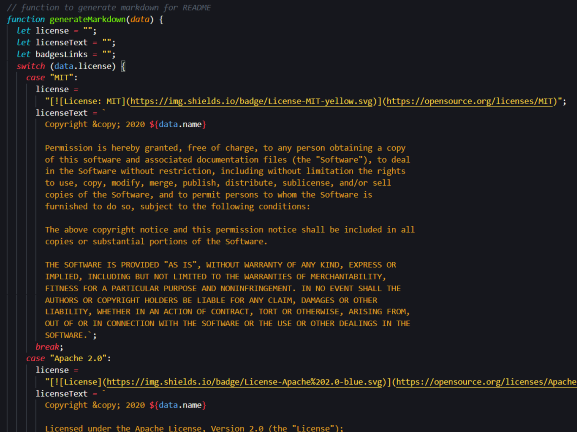
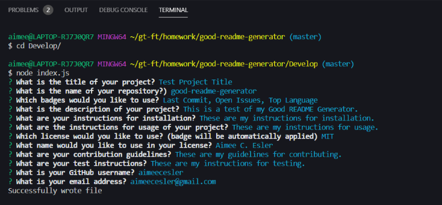

# Good README Generator

This repository consists of a command line application that creates a standard README document for a project based on the user's input.

-----

## Table of Contents

* [Installation](#installation)
* [Usage](#Usage)
* [Building the README Generator](#building-the-README-generator)
* [Acceptance Criteria](#acceptance-criteria)
* [Credits](#credits)
* [Resources](#resources)
* [Links](#Links)
* [License](#license)

-----

## Installation

1. Follow the GitHub Repository Link in the [Links](#Links) section below.
1. Clone the repository using an SSH key.
1. Open GitBash and use "git clone" to clone the repository.
1. Run npm install to install associated modules.

-----

## Usage

Edit using VSCode after [installation](#installation). JavaScript and package.json files are included.

-----

## Building the README Generator
When a user enters the terminal and navigates to the Develop folder, they then run 'node index.js'. This will begin the user input portion of the command line application. Through a series of questions, the user will build their custom README.md file. Based on the user's input the application will then write a .md file (in this application it is named ) that contains a title, badges, description and table of contents.It also includes installation, usage, license, contributing, tests and questions sections. You will find that all badges are linked to the user's chosen repository and there are also links to their GitHub profile as well as their email in the questions section.

-----

## Acceptance Criteria

* GIVEN a command-line application that accepts user input :heavy_check_mark:
* WHEN I am prompted for information about my application repository :heavy_check_mark:
* THEN a quality, professional README.md is generated with the title of your project and sections entitled Description, Table of Contents, Installation, Usage, License, Contributing, Tests, and Questions :heavy_check_mark:
* WHEN I enter my project title :heavy_check_mark:
* THEN this is displayed as the title of the README :heavy_check_mark:
* WHEN I enter a description, installation instructions, usage information, contribution guidelines, and test instructions :heavy_check_mark:
* THEN this information is added to the sections of the README entitled Description, Installation, Usage, Contributing, and Tests :heavy_check_mark:
* WHEN I choose a license for my application from a list of options :heavy_check_mark:
* THEN a badge for that license is added hear the top of the README and a notice is added to the section of the README entitled License that explains which license the application is covered under :heavy_check_mark:
* WHEN I enter my GitHub username :heavy_check_mark:
* THEN this is added to the section of the README entitled Questions, with a link to my GitHub profile :heavy_check_mark:
* WHEN I enter my email address :heavy_check_mark:
* THEN this is added to the section of the README entitled Questions, with instructions on how to reach me with additional questions :heavy_check_mark:
* WHEN I click on the links in the Table of Contents :heavy_check_mark:
* THEN I am taken to the corresponding section of the README :heavy_check_mark:

-----

## Credits
As always, a huge thanks to our instructional staff for all their hard work!

## Resources

* [w3schools](https://www.w3schools.com)
* [Node.js](https://nodejs.org/en/)
* [Inquirer](https://www.npmjs.com/package/inquirer)

-----

## Links
[Repository Link](https://github.com/aimeecesler/good-readme-generator)

[Demonstration Video]()

-----

## License
Copyright &copy; 2020 Aimee Corbin Esler

    Permission is hereby granted, free of charge, to any person obtaining a copy
    of this software and associated documentation files (the "Software"), to deal
    in the Software without restriction, including without limitation the rights
    to use, copy, modify, merge, publish, distribute, sublicense, and/or sell
    copies of the Software, and to permit persons to whom the Software is
    furnished to do so, subject to the following conditions:

    The above copyright notice and this permission notice shall be included in all
    copies or substantial portions of the Software.

    THE SOFTWARE IS PROVIDED "AS IS", WITHOUT WARRANTY OF ANY KIND, EXPRESS OR
    IMPLIED, INCLUDING BUT NOT LIMITED TO THE WARRANTIES OF MERCHANTABILITY,
    FITNESS FOR A PARTICULAR PURPOSE AND NONINFRINGEMENT. IN NO EVENT SHALL THE
    AUTHORS OR COPYRIGHT HOLDERS BE LIABLE FOR ANY CLAIM, DAMAGES OR OTHER
    LIABILITY, WHETHER IN AN ACTION OF CONTRACT, TORT OR OTHERWISE, ARISING FROM,
    OUT OF OR IN CONNECTION WITH THE SOFTWARE OR THE USE OR OTHER DEALINGS IN THE
    SOFTWARE.